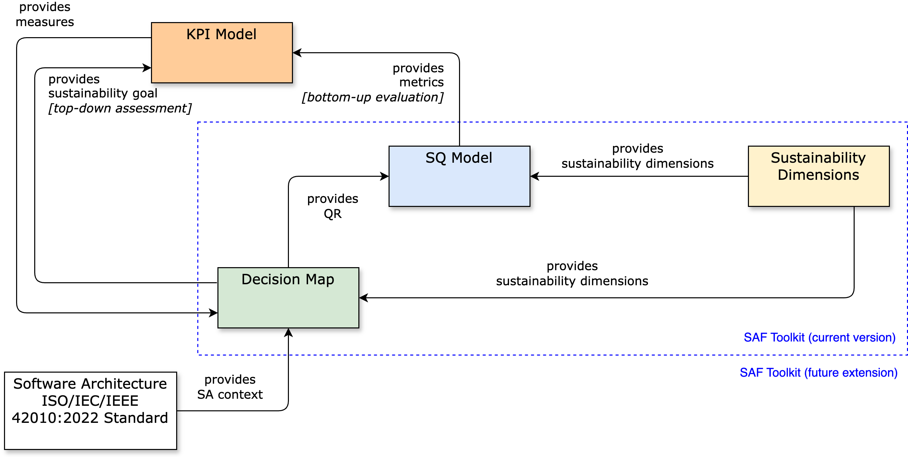
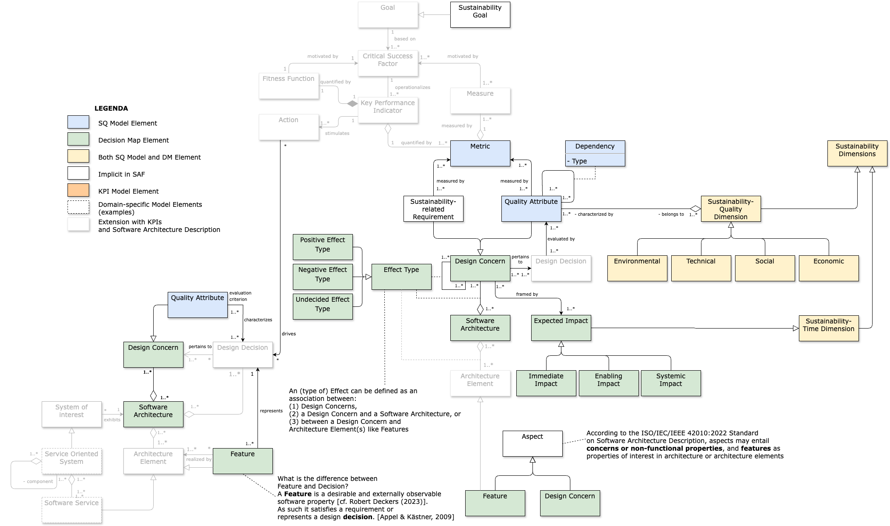

# SAF-Toolkit
## Sustainability Assessment Framework (SAF) Toolkit
This reporitory contains the material of SAF-Tooolkit, a set of instruments to design the network of sustainability-quality concerns at the software architecture level, and define and operationalize them.

The SAF-Toolkit was developed at the Vrije Universiteit Amsterdam. It entails the following instruments:
1. [**Decision Map (DM)**](./SAF%20Toolkit%20[2024-02]/[2024-02]%20DM%20Library%20[features+concerns].xml) visual notation (library to be used in the [Diagrams.net tool](https://www.diagrams.net)): diagram framing and illustrating the (software architecture) sustainability-relevant design- and quality concerns and their related dependencies;
2. [**Checklist**](./SAF%20Toolkit%20[2024-02]/[2024-02]%20Checklist.pdf): reflective questions to help defining the elements of a DM; this include the [**Decision Graph**](./SAF%20Toolkit%20[2024-02]/[2022-04]%20DecisionGraph.pdf), which helps the classification of concerns in the sustainability dimensions and level of impact;
3. [**Dependency Matrix'es (DMatrix) template**](./SAF%20Toolkit%20[2024-02]/[2024-02]%20_template_DMatrix.xlsx): helps completing and complementing the own DM for the most relevant sustainability dimensions; identifying missing sustainability-quality concerns; and identifying missing dependencies. It includes: (i) instructions for use and extension; DMatrix of dependencies between SQ concerns (ii) in the Technical-Social dimensions; (iii) in the Technical-Environmental dimensions; and (iv) in the Technical-Economic dimensions (version 2022-04);
4. [**Sustainability-Quality (SQ) Model template**](./SAF%20Toolkit%20[2024-02]/[2024-02]%20_template_SQ-Model.xlsx): for each SQ concern (aka attribute aka characteristic), it captures consolidated definitions and the metrics/KPIs to operationalize them. It includes: (i) the template to define the own SQ model; and (ii) the SQ Model (version 1.1 dated 2022-04) created from past projects and the ISO/IEC 25010-2011 standard.
5. [**Key Performance Indicator (KPI) template**](./SAF%20Toolkit%20[2024-02]/[2024-02]%20_template_KPI%20Model%20w_%20Checklist.xlsx): to establish and define the metrics and measures for the QAs within the SQ Model systematically, we aim to incorporate a KPI Model. It includes: (i) the KPI model as template for crafting own KPIs derived from the SQ model; and (ii) a practical KPI checklist for evaluating their soundness.

## SAF Toolkit Overview
High-level overview of all involved instruments and their relation. Instruments inside the dashed-blue rectangle are available in its current version; instruments outside are plan of our future vision and have yet to be integrated.

<p align="center">

</p>

## SAF Toolkit Model
The instruments managed by the SAF Toolkit are visualized below containing a detailed-level overview of all involved instruments, their elements and relation. Colored elements are available in its current version; Transparent elements are plan of our future vision and have yet to be integrated.


<p align="center">

</p>

## How to cite SAF Toolkit

If SAF Toolkit is helping your research or practice, please credit our work by citing it as follows, thanks!

``` 
@MISC{SAF_Toolkit_2024,
  title="{The Sustainability Assessment Framework (SAF) Toolkit: Instruments to help Sustainability-driven Software Architecture Design Decision Making}",
  author={Patricia Lago and {S2 Research Group}},
  month=apr,
  year={2024},
  url={https://github.com/S2-group/SAF-Toolkit},
  institution="S2 Group, Vrije Universiteit Amsterdam"
}
```

## Publications
The material included in this repository is based on the following publications:

> Lago, P., Fernandez, N. C., Fatima, I., Funke, M., & Malavolta, I. (2024). The Sustainability Assessment Framework Toolkit: A Decade of Modeling Experience. In arXiv [cs.SE]. arXiv. http://arxiv.org/abs/2405.01391. Accepted for publication in: The journal of Software and Systems Modeling, Springer.
> 
> Lago, P. (2019). Architecture design decision maps for software sustainability. In IEEE/ACM 41st International Conference on Software Engineering: Software Engineering in Society (ICSE-SEIS) (pp. 61-64). [8797634]. https://doi.org/10.1109/ICSE-SEIS.2019.00015

> Condori-Fernandez, N., & Lago, P. (2018). Characterizing the contribution of quality requirements to software sustainability. Journal of Systems and Software, 137, 289-305. https://doi.org/10.1016/j.jss.2017.12.005

> Condori-Fernandez, N., & Lago, P. (2019). Towards a software sustainability-quality model: Insights from a multi-case study. In M. Kolp, J. Vanderdonckt, M. Snoeck, & Y. Wautelet (Eds.), 13th International Conference on Research Challenges in Information Science (RCIS). IEEE Computer Society. https://doi.org/10.1109/RCIS.2019.8877084

> Condori Fernandez, O. N., & Lago, P. (2019). Using Participatory Technical-action-research to validate a Software Sustainability Model. In A. Wolff (Ed.), ICT4S 2019 - Proceedings of the 6th International Conference on ICT for Sustainability. Lappeenranta, Finland, June 10-14, 2019. CEUR-WS. http://ceur-ws.org/Vol-2382/ICT4S2019_paper_1.pdf

> Condori-Fernandez, N., Lago, P., Luaces, M. R., & Places, Á. S. (2020). An action research for improving the sustainability assessment framework instruments. Journal of Sustainability (Switzerland), 12(4). [1682]. https://doi.org/10.3390/su12041682

> Fatima, I., Funke, M., Lago, P. Providing Guidance to Software Practitioners: A Framework for Creating KPIs. TechRxiv. February 13, 2024. https://doi.org/10.36227/techrxiv.24057882.v2


## Case studies experimenting with the SAF Toolkit
Case studies experimenting with the SAF Toolkit:

> Espana, S., Lago, P. Software Sustainability Assessment (SoSA) exercise report. Technical report, Vrije Universiteit Amsterdam (May 2016). https://goo.gl/d9FYi9

> Verdecchia, R., Procaccianti, G., Malavolta, I., Lago, P., Koedijk, J. Estimating Energy Impact of Software Releases and Deployment Strategies: The KPMG Case Study. In: International Symposium on Empirical Software Engineering and Measurement (ESEM), pp.257–266. Springer, Ljubljana, Slovenia (2017). https://doi.org/10.1109/ESEM.2017.39

> Niggebrugge, T., Vos, S., Lago, P.: The Sustainability of Mobility as a Service Solutions Evaluated through the Software Sustainability Assessment Method. Technical report, Vrije Universiteit Amsterdam (January 2018)

> Lago, P. Architecture Design Decision Maps for Software Sustainability. In: 41st International Conference on Software Engineering: Software Engineering in Society (ICSE-SEIS). ICSE, pp. 61–64. IEEE/ACM, Montr´eal, Canada (2019). http://dx.doi.org/10.1109/ICSE-SEIS.2019.00015

> Vos, S., Schaefers, H., Bon, A., Lago, P. Sustainability and Ethics by Design: On the development of digital platforms in low-resource environments. Technical report, Vrije Universiteit Amsterdam (December 2020). https://research.vu.nl/files/137357217/ICT4FoodSec1.pdf

> Vos, S., Schaefers, H., Lago, P., Bon, A. Towards Sustainability and Equality in Digital Development. In: The Future of Digital Work: The Challenge of Inequality. IFIP AICT, vol. 601. Springer, Cham (2020). http://link.springer.com.vu-nl.idm.oclc.org/978-3-030-64697-4

> Bischoff, Y., Wiel, R., Hooff, B., Lago, P. A taxonomy about information systems complexity and sustainability. In: Advances and New Trends in Environmental Informatics, pp.17–33. Springer, Cham (2022)

> Lago, P., Verdecchia, R., Condori-Fernandez, N., Rahmadian, E., Sturm, J., Nijnanten, T., Bosma, R., Debuysscher, C., Ricardo, P. Designing for Sustainability: Lessons Learned from Four Industrial Projects. In: Advances and New Trends in Environmental Informatics, pp. 3–18. Springer, Cham (2021). https://doi.org/10.1007/978-3-030-61969-51

> Funke, M., Lago, P., Verdecchia, R.: Variability Features: Extending Sustainability Decision Maps via an Industrial Case Study. In: 2023 IEEE 20th International Conference on Software Architecture Companion (ICSA-C), pp. 1–7. IEEE, L’Aquila, Italy (2023)


## Directory Structure
This is the root directory of the repository. The directory is structured as follows:

    SAF Toolkit TODO
     .
     |        
     |--- SAF Toolkit [2022-04]/            Previous version of the SAF Toolkit, including its instruments                              
        |                         
        |--- documentation/                    SAF Toolkit models as UML diagrams; files used for the README
        |
        |--- tutorials/                        Tutorials on how to use the SAF Toolkit
     |--- SAF Toolkit [2024-02]/            Current version of the SAF Toolkit, including its instruments                              
        |                         
        |--- documentation/                    SAF Toolkit models as UML diagrams; files used for the README
        |
        |--- tutorials/                        Tutorials on how to use the SAF Toolkit
